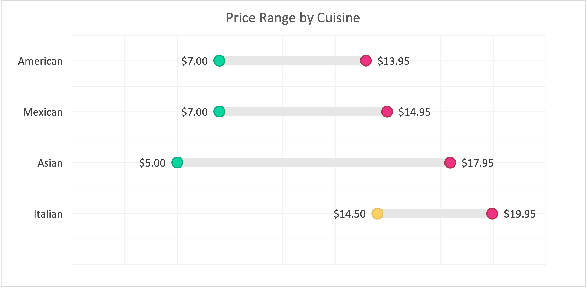
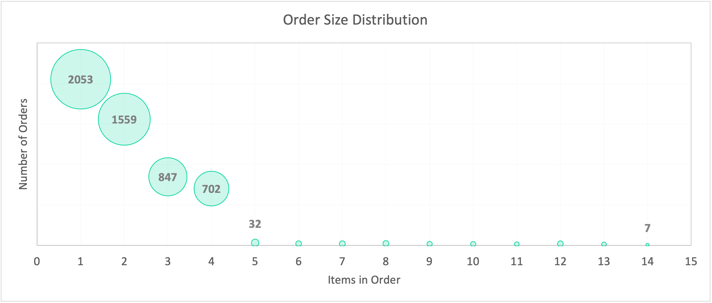
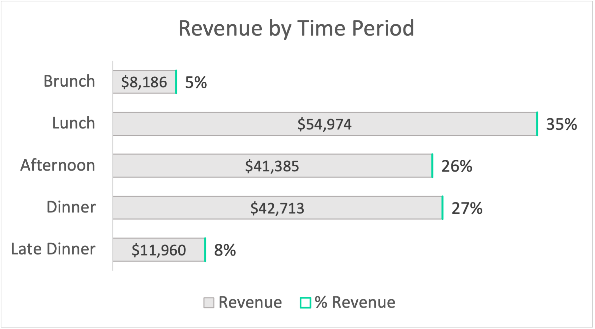
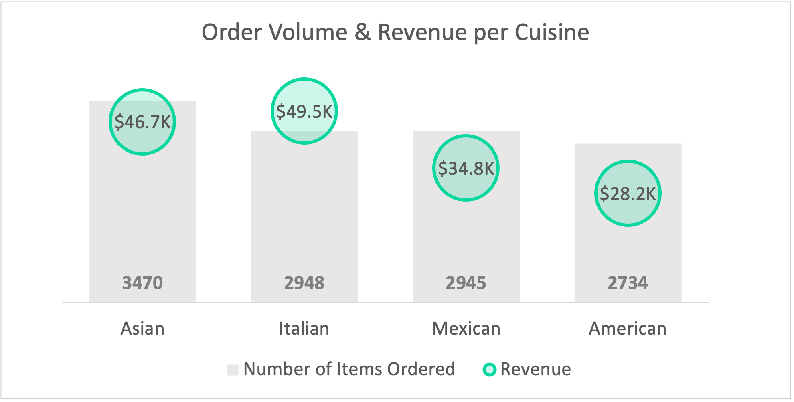

# Restaurant Pricing Analysis

## Overview
This project analyses restaurant transaction data to understand how pricing, menu structure, and customer behaviour influence revenue performance.

---

## Key Focus Areas
- Revenue performance across price tiers and cuisines  
- Customer behaviour by time of day and weekday  
- Identification of high-performing items and revenue drivers  
- Opportunities for pricing optimisation and menu improvement  

---

## Key Insights
- Mid-range items drive the majority of revenue through volume  
- Premium items generate strong value despite lower demand  
- Lunch is the most commercially valuable time period  
- Revenue is relatively stable across weekdays  
- A small number of items contribute a disproportionate share of revenue  

---

## Tools Used
- SQL (MySQL)  
- Excel (analysis & visualisation)  

---

## Project Files
- `/sql` → SQL queries used for analysis  
- `/excel` → structured outputs and charts  
- `/visuals` → key visualisations  

---

## Full Analysis
👉 [View full project write-up](https://irinamicov.notion.site/Restaurant-Pricing-Analysis-Optimising-Menu-Strategies-for-Revenue-Growth-1c032133b5cf8051a719c2ebb1259b45)  

---

## Data Source
[Maven Analytics Data Playground](https://mavenanalytics.io/data-playground)